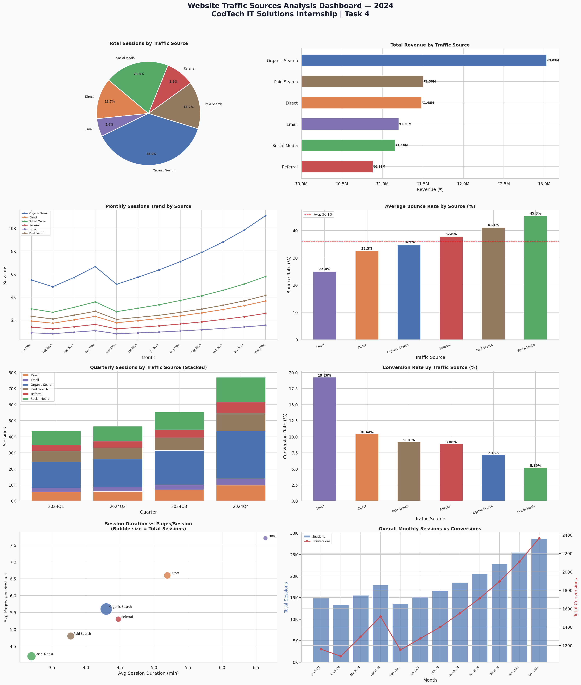

# 🌐 Task 4 — Website Traffic Sources Analysis

<p align="center">
  
</p>

---

## 👤 Intern Information

| Field | Details |
|---|---|
| **Intern Name** | Yogesh Kumar Gour |
| **Intern ID** | CITS2677 |
| **Company** | CODTECH IT Solutions Pvt. Ltd |
| **Domain** | Data Analytics |
| **Task** | Website Traffic Sources|
| **Mentor** | Neela Santhosh Kumar |
| **Duration** | 4 Weeks |

---

## 📌 Objective

Analyze website traffic data across multiple sources to uncover:
- Which channels drive the most sessions and revenue
- How bounce rates and conversion rates differ by source
- Monthly and quarterly growth trends across all traffic channels
- Engagement quality metrics (session duration, pages per session)

---

## 📁 Files in This Repository

```
Task-4_Website-Traffic-Sources/
│
├── website_traffic_data.csv        # Dataset — 174 records across 6 traffic sources (2024)
├── website_traffic_analysis.py     # Python script for full analysis & 8-panel dashboard
├── website_traffic_analysis.png    # Output dashboard (8 visualizations)
└── README.md                       # Project documentation (this file)
```

---

## 🛠️ Technologies Used

| Tool / Library | Purpose                                    |
|----------------|--------------------------------------------|
| Python 3.14.5     | Core programming language               |
| Pandas         | Data loading, cleaning, and aggregation    |
| Matplotlib     | Plotting all charts and the dashboard      |
| Seaborn        | Styling and theme configuration            |
| NumPy          | Numerical operations for stacked charts    |

---

## 📊 Dataset Overview

- **File:** `website_traffic_data.csv`
- **Records:** 174 rows (bi-weekly data, Jan–Dec 2024)
- **Traffic Sources:** 6 (Organic Search, Direct, Social Media, Referral, Email, Paid Search)

| Column                  | Description                                    |
|-------------------------|------------------------------------------------|
| Date                    | Date of the recorded data point                |
| Traffic_Source          | Channel driving the traffic                    |
| Sessions                | Total number of sessions                       |
| Users                   | Number of unique users                         |
| New_Users               | First-time visitors                            |
| Bounce_Rate             | % of single-page sessions (lower = better)     |
| Avg_Session_Duration    | Average time spent per session (minutes)       |
| Pages_Per_Session       | Average pages viewed per session               |
| Conversions             | Number of goal completions                     |
| Revenue                 | Revenue generated (₹)                          |

---

## 📈 Visualizations Created (8-Panel Dashboard)

| # | Chart Type           | Insight                                               |
|---|----------------------|-------------------------------------------------------|
| 1 | Pie Chart            | Share of total sessions by traffic source             |
| 2 | Horizontal Bar       | Total revenue generated per source                    |
| 3 | Multi-Line Chart     | Monthly session trends for all 6 sources              |
| 4 | Bar Chart            | Average bounce rate comparison across sources         |
| 5 | Stacked Bar Chart    | Quarterly sessions breakdown by source                |
| 6 | Bar Chart            | Conversion rate (%) by traffic source                 |
| 7 | Bubble Scatter Plot  | Session duration vs pages/session (bubble = volume)   |
| 8 | Dual-Axis Chart      | Overall monthly sessions (bar) + conversions (line)   |

---

## 🔑 Key Findings

| Metric                  | Result                                         |
|-------------------------|------------------------------------------------|
| 💰 Total Revenue         | ₹92,53,000                                    |
| 👥 Total Sessions        | 2,22,723                                      |
| ✅ Total Conversions      | 18,506                                        |
| 🏆 Top Source (Sessions) | Organic Search                                |
| 💵 Top Source (Revenue)  | Organic Search                                |
| 🎯 Best Conversion Rate  | Email (19.26%)                                |
| 📉 Lowest Bounce Rate    | Email (25.0%)                                 |
| 📈 Highest Bounce Rate   | Social Media (45.3%)                          |

---

## 💡 Business Insights

- **Organic Search** dominates in raw sessions and revenue — SEO investment is paying off
- **Email** has the best conversion rate (19.26%) and lowest bounce rate — highly engaged audience
- **Social Media** drives significant sessions but has the worst bounce rate (45.3%) — content quality needs improvement
- **Paid Search** has a high bounce rate (41.1%) relative to its conversion rate — landing pages may need optimization
- All sources show a consistent **upward trend** from Q1 to Q4 2024

---

## ▶️ How to Run

### Step 1 — Clone the repository
```bash
git clone https://github.com/[YOUR-GITHUB-USERNAME]/CodTech-DataAnalytics-Internship.git
cd CodTech-DataAnalytics-Internship/Task-4_Website-Traffic-Sources
```

### Step 2 — Install dependencies
```bash
pip install pandas matplotlib seaborn numpy
```

### Step 3 — Run the script
```bash
python website_traffic_analysis.py
```

The 8-panel dashboard will be saved as `website_traffic_analysis.png`.

---
